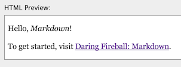

= Hello, World!

在 http://daringfireball.net/projects/markdown/dingus[Markdown Digus] 的 Markdown Source 輸入：

----
Hello, _Markdown_!

To get started, visit [Daring Fireball: Markdown](https://daringfireball.net/projects/markdown/).
----

按下 Convert，可以看到對應的 HTML Source 及預覽：

[source,html]
----

Hello, <em>Markdown</em>!

To get started, visit <a href="https://daringfireball.net/projects/markdown/">Daring Fireball: Markdown</a>.

----

對照 Markdown 與 HTML，可以看出其間的對應關係：

 * 在文字兩側加上 `_`，可以強調 (`<em>`) 中間的文字。
 * 空白行可以分開不同的段落 (`
`)。
 * `[{link_text}]({url})`，會產生一個超連結，_link_text_ 就是超連結的文字。

TIP: **觀察 Markdown 語法產生的 HTML，是一種很好的學習方式**，可以試著調整 Markdown 的寫法，並觀察 HTML 是否會跟著產生變化，尤其是文字說明不清楚的地方，試就對了。

注意到了嗎，為什麼不說「加上 `\_` 會有斜體的效果」？因為 `_` 會產生 https://www.w3.org/TR/html5/text-level-semantics.html#the-em-element[`<em>`] (stress emphasis) 而非 https://www.w3.org/TR/html5/text-level-semantics.html#the-i-element[`<i>`] (italic)，只是通常 `<em>` 會以斜體的方式來表現而已。

也就是說，**重點應該擺在 HTML 標籤 (tag) 的語意 (semantics)，而非最終的表現方式 (presentation)**。例如兩側加上 `\_` (或 `\*`) 會產生 `<em>`，在兩側加上 `__` (或 `**`) 則會產生 https://www.w3.org/TR/html5/text-level-semantics.html#the-strong-element[`<strong>`] (稍後說明)。前者 `<em>` (stress emphasis) 用來在一個句子裡強調某個部份 (local emphasis)，閱讀到該處時才會注意到，通常用斜體表現；後則 `<strong>` (strong importance) 則用來突顯某一段文字的重要性 (global highlighting)，使能夠很快就掃出整份文件的重點，通常用粗體表現。

// http://fanli7.net/a/caozuoxitong/OS/20110929/131904.html[詳解em與strong的區別_StackDoc]

[quote]
____
 * https://www.w3.org/TR/html5/text-level-semantics.html[4.5 Text-level semantics — HTML5]
____

這就是 Markdown，使能夠專注在內容跟語意上，不過在這之前必須要能掌不同 Markdown 語法間語意上的差異才行。以上面的 `\_` 跟 `__` 為例，斜體跟粗體的差異只是表象，背後的語意才是重點。

== Markdown 檔案

雖然大部份時候都不需要把 Markdown 文件存成檔案，但若有需要，**副檔名在慣例上會採用 `.md`**。例如 `helloworld.md`：

----
Hello, _Markdown_!

To get started, visit [Daring Fireball: Markdown](https://daringfireball.net/projects/markdown/).
----

用 link:../markdown-cli.adoc[`Markdown.pl`] 轉換為 HTML 的過程會是這樣：

----
$ markdown helloworld.md

Hello, <em>Markdown</em>!

To get started, visit <a href="https://daringfireball.net/projects/markdown/">Daring Fireball: Markdown</a>.

----

