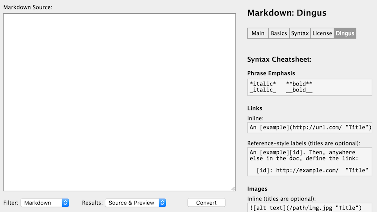

= 安裝設定

Markdown 是一個開放的純文字格式，只要有文字編輯器就能撰寫。不過若要確認格式是否符合要求，就需要一個能將它轉換為 HTML 的工具，檢查輸出的結果是不是你要的。

Markdown 因為種種原因而發展出不同的link:../variants/README.adoc[變形]，**建議初學者利用上一節提到的 `Markdown.pl` 來學習 Markdown 語法，有助於之後分辨哪些語法是最初的標準，哪些又是額外擴充的**。

不過這裡並不打算在本地端安裝 `Markdown.pl`，而是使用線上的 Markdown Digus 來學習；它背後也是使用 `Markdown.pl`，而且版本比最後釋出的 1.0.1 還新。

[quote]
____
 * http://daringfireball.net/projects/markdown/dingus[Markdown Digus] 線上編輯器
____

把 Markdown 寫在上面 Markdown Source 的欄位，按下 Convert，就可以在下面看到對應的 HTML 原始碼及預覽。

若要在本地端使用 `Markdown.pl`，可以參考link:../markdown-cli.adoc[這裡]。

